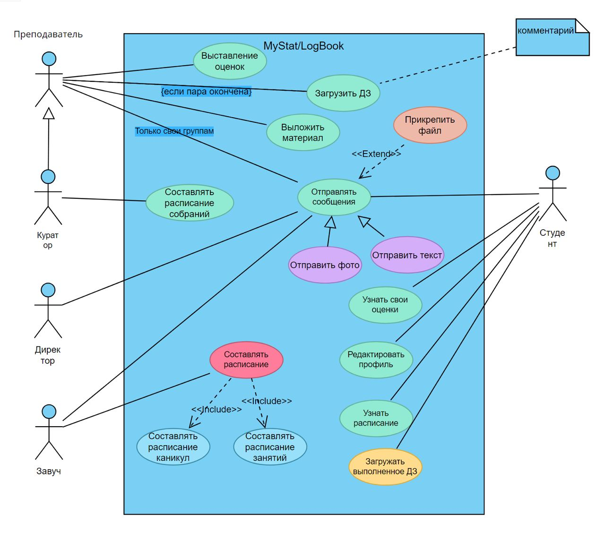
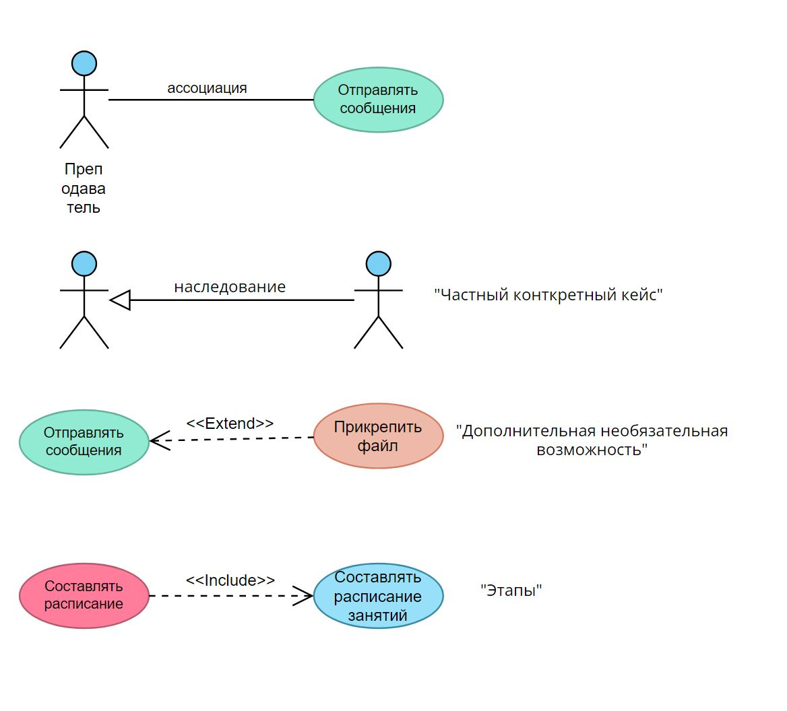

# Набор материалов для первой полноценной консультации

## 1. Тема
> Тема должна кратко, ёмко и точно отражать суть приложения

**Пример:** Разработка информационной системы для управления учебным процессом школы

## 2. Usecase диаграмма
> Полноценная Usecase диаграмма с макимально возможным набором кейсов. В процессе будет редактироваться. Желательно, в интерактивном виде (в редакторе)

**Пример:**

**Таблетка для памяти:**

## 3. Структура (желательно)
> Под структурой подразумевается Ваше видение элементов всей системы и взаимодействия между ними. Можно описать текстом или графически (deployment diagramm)

**Пример:**
