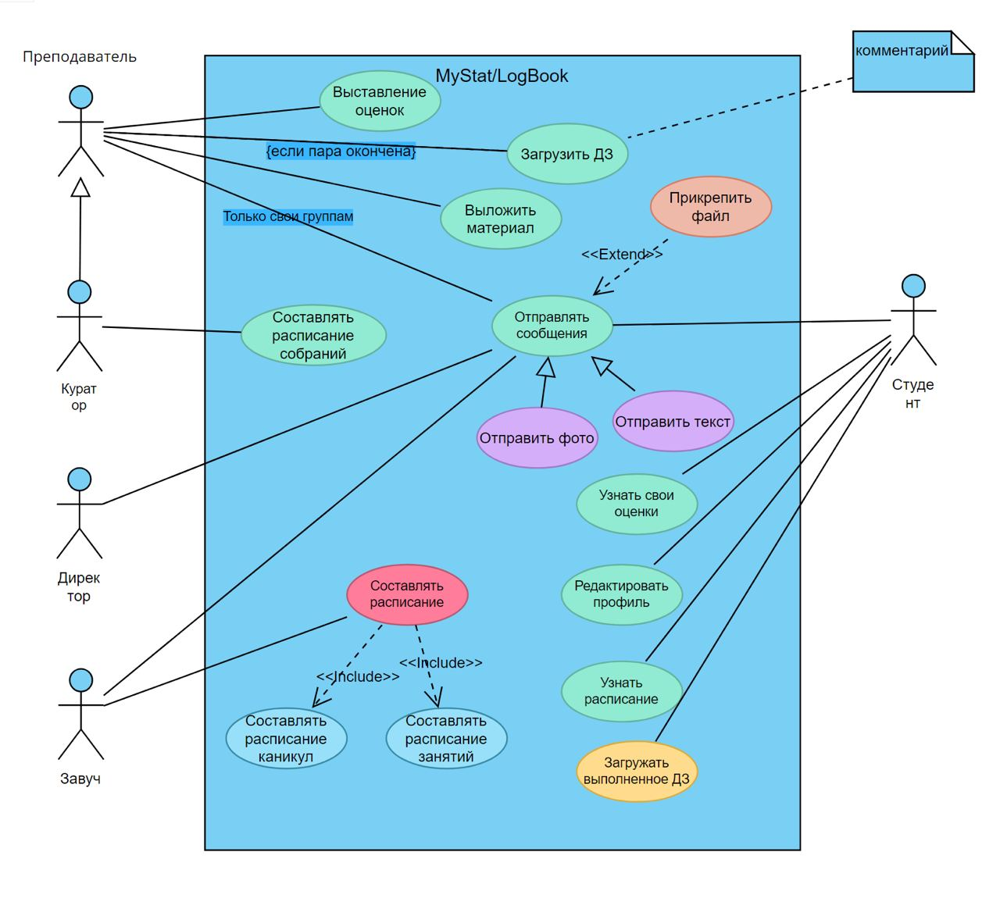
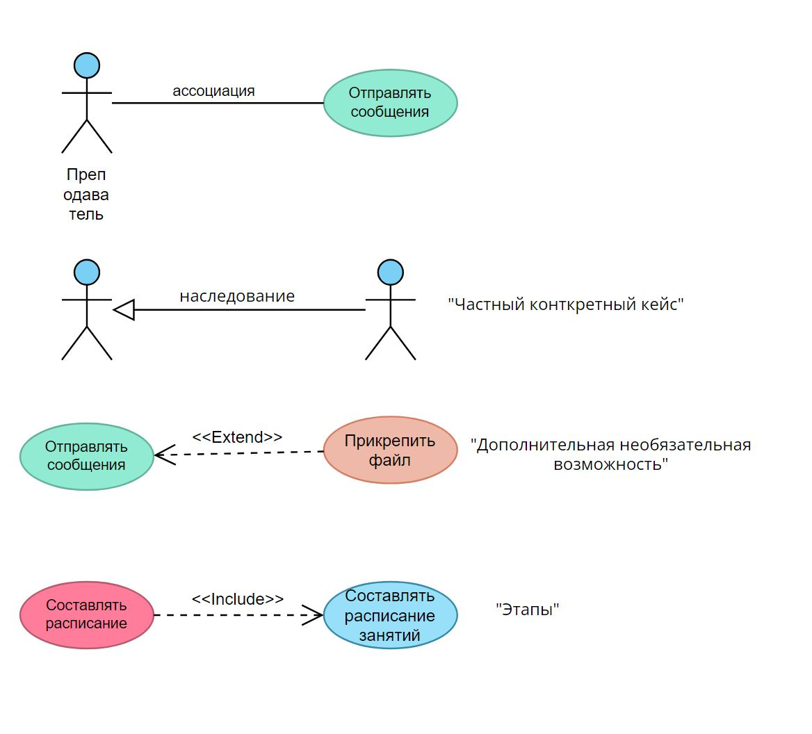
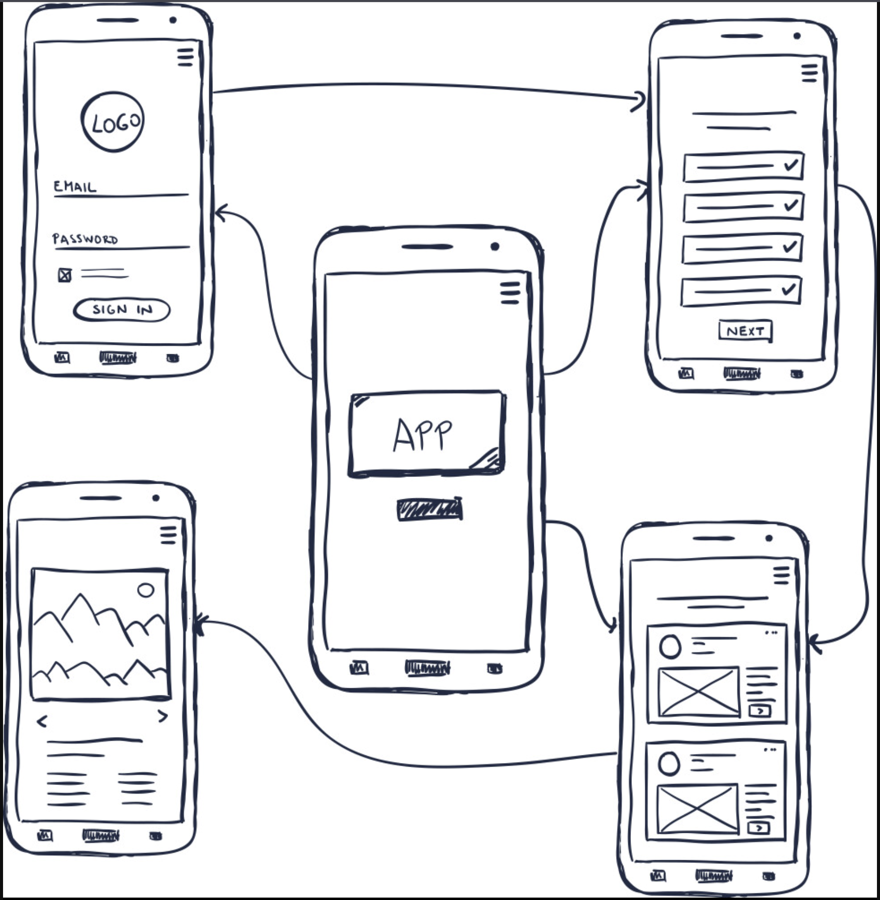

# Структура документа на первом этапе разработки

## 1. Тема.
> Тема должна кратко, ёмко и точно отражать суть приложения

**Пример:**

"Разработка информационной системы для управления учебным процессом школы"

## 2. UseCase диаграмма.
> Полноценная UseCase диаграмма с максимально возможным набором вариантов использования (в процессе будет редактироваться). Желательно, в интерактивном формате (в редакторе)

**Пример:**

**Таблетка для памяти:**

## 3. Наброски интерфейса.
> Это может быть проект в Figma (если работаете с дизайнером), набросок в любом графическом редакторе или, на крайний случай, рисунок на бумаге

**Пример:**

## 4. Структура (желательно).
> Под структурой подразумевается Ваше видение элементов всей системы и взаимодействия между ними. Можно описать текстом или графически (deployment diagramm)

**Пример:**

## 5. Используемые технологии.
> Перечислите языки программирования, фреймворки/библиотеки, вспомогательные системы, сторонние сервисы и т.д., которые планируете использовать в проекте.

**Пример:**
- Языки
  - PHP
  - JavaScript
  - Python
- Фреймворки/библиотеки
  - Laravel 11 (https://laravel.com/)
  - Koa (https://koajs.com/)
  - Django (https://www.djangoproject.com/)
  - python-telegram-bot (https://docs.python-telegram-bot.org/en/stable/index.html)
- Вспомогательные системы
  - Redis
  - RabbitMQ
- Сторонние сервисы
  - Amazon S3
- Инструменты разработки
  - GIT
  - Docker

## Общие рекомендации.

1. Рассматривайте подобный документ, как задел под ТЗ.
2. Отнеситесь максимально ответственно к этому этапу! От этого зависит продуктивность дальнейшей работы.
3. Если состоите в команде, устройте "мозговой штурм".
4. В процессе работы вносите изменения в любой пункт.
5. Рассмотрите формат `.md` как предпочтительный для составления подобного документа (просто редактируется, интерпретируется `Github`).

Удачи! ✌️
